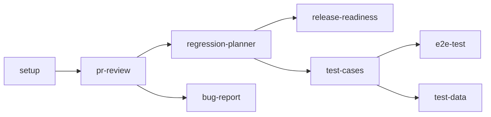

<div align="center">

# QA Toolkit

**QA that thinks for itself.**

Describe what you're testing. Get a structured, stack-aware artifact — instantly.

[](https://github.com/cyberwalk3r/qa-toolkit)
[](LICENSE)
[](https://github.com/cyberwalk3r/qa-toolkit/actions)

<br>

```bash
claude plugin add github:cyberwalk3r/qa-toolkit
```

<br>

</div>

---

## Motivation

QA work is repetitive in the worst way. Every bug report needs the same structure. Every PR review needs the same checks. Every regression plan needs the same risk analysis. And every team member does it differently.

QA Toolkit handles the formatting so you can focus on the judgment. Describe what you're testing in plain English — get back something you can actually use. It auto-detects your stack, remembers your project context, and produces consistent QA artifacts every time. Whether you're a dedicated QA lead or a developer wearing the QA hat, it adapts to your stack and your tracker without asking you to configure anything.

---

## Quick Start

```bash
# 1. Install
claude plugin add github:cyberwalk3r/qa-toolkit

# 2. Open any project — detection runs automatically

# 3. Confirm your setup (recommended first command)
/qa-toolkit:setup
```

After setup, try `/qa-toolkit:pr-review` on a real PR or `/qa-toolkit:test-cases` with a feature description. Each skill output includes **Suggested Next Steps** pointing you to related commands.

All output lands in `qa-artifacts/` — add it to `.gitignore` if you don't want to commit QA artifacts.

### Recommended Workflow

Skills are most powerful when chained. Each one feeds context into the next:



Start anywhere — every skill works standalone — but chaining builds richer context.

---

## How It Works

**1. Install the plugin**
```bash
claude plugin add github:cyberwalk3r/qa-toolkit
```

**2. Open any project**

On session start, QA Toolkit scans your project — languages, frameworks, test tools, CI/CD — and saves the context to `qa-artifacts/.qa-context.json`. No prompts. No setup.

**3. Describe what you need**
```
/qa-toolkit:bug-report The checkout page crashes when I enter a long address
```

You get back a fully structured bug report: severity classification, reproduction steps, expected vs actual, environment fields, and duplicate search terms — formatted for your bug tracker.

---

## Commands

### Authoring
| Command | What You Get |
|---------|-------------|
| `/qa-toolkit:test-cases` | Test cases from requirements — table, Gherkin, or checklist |
| `/qa-toolkit:test-plan` | Full test plan with scope, strategy, and coverage targets |
| `/qa-toolkit:test-data` | Synthetic test data — JSON, CSV, or SQL |
| `/qa-toolkit:e2e-test` | Playwright test scaffold with line-by-line comments |
| `/qa-toolkit:api-test` | API test suite — cURL, Postman collection, or Playwright |

### Review
| Command | What You Get |
|---------|-------------|
| `/qa-toolkit:pr-review` | Risk-flagged PR review with plain-English summary and QA checklist |
| `/qa-toolkit:bug-report` | Structured bug report from a casual description |
| `/qa-toolkit:exploratory-testing` | Exploratory test charters with session-based heuristics |

### Release
| Command | What You Get |
|---------|-------------|
| `/qa-toolkit:regression-planner` | Risk-based regression plan with time estimates |
| `/qa-toolkit:release-readiness` | Go/no-go assessment with quality gate scoring |
| `/qa-toolkit:risk-prioritization` | Ranked risk matrix across features and change areas |

### Analysis
| Command | What You Get |
|---------|-------------|
| `/qa-toolkit:coverage-gap` | Coverage gap analysis against requirements or test plan |
| `/qa-toolkit:flaky-test-diagnosis` | Root cause analysis for flaky tests with fix recommendations |
| `/qa-toolkit:accessibility` | WCAG 2.1 audit with plain-English manual test scripts |
| `/qa-toolkit:setup` | Read project docs, confirm detection, save preferences |

---

## Agents

Three QA personas for multi-turn interactive work — use these when you want a conversation, not a document.

| Agent | What It Does |
|-------|-------------|
| `qa-reviewer` | Reads PRs and translates code changes into testing impact — which user flows are at risk, what to test first, what's safe to skip |
| `qa-explorer` | Generates edge cases and exploratory charters from feature descriptions — finds the scenarios your requirements didn't think to mention |
| `qa-lead` | Makes release decisions, plans regression scope, and produces executive summaries — the QA voice in a release meeting |

Agents remember context across the conversation. The more you share, the sharper the output.

### Skills vs Agents

**Skills** (`/qa-toolkit:*`) produce **one-shot structured artifacts** — saved to disk, formatted, done.

**Agents** are **conversational** — use them for ongoing discussion, decision-making, and exploratory work.

> **When to pick an agent:** Use `qa-reviewer` when walking through a PR interactively. Use `qa-explorer` when brainstorming edge cases for a feature. Use `qa-lead` when deciding whether a release is ready to ship. If you want a saved artifact instead of a conversation, use the corresponding skill.

---

## Output

Everything saves to `qa-artifacts/` in your project root (configurable via `settings.json`).

### settings.json

| Setting | Type | Default | Description |
|---------|------|---------|-------------|
| `agent` | string | `"qa-reviewer"` | Default agent persona for interactive sessions |
| `outputDir` | string | `"qa-artifacts"` | Output directory (relative path, no `..`) |
| `hooksEnabled` | boolean | `true` | Enable/disable SessionStart and Stop hooks |
| `detectionBudgetMs` | number | `500` | Time budget (ms) for project auto-detection phases |

### Artifact structure

```
qa-artifacts/
├── .qa-context.json         # Auto-detected project config and session state
├── .qa-activity.log         # Session activity log
├── a11y-audits/
├── api-tests/
├── bug-reports/
├── coverage-analysis/
├── e2e-tests/
├── exploratory/
├── flaky-diagnosis/
├── pr-reviews/
├── regression-plans/
├── release-assessments/
├── risk-analysis/
├── test-cases/
├── test-data/
└── test-plans/
```

### .qa-context.json Schema

Top-level fields:

| Field | Type | Description |
|-------|------|-------------|
| `schemaVersion` | number | Schema version (currently `1`) |
| `detectedAt` | string | ISO 8601 timestamp of last detection |
| `projectRoot` | string | Absolute path to project directory |
| `outputDir` | string | Configured output directory name |
| `detection` | object | Auto-detected project info (see below) |
| `conventions` | object | Formatting, linting, TypeScript, test patterns |
| `detectionTiming` | object | Phase timing and budget data |
| `risks` | object[] | Accumulated risk findings across sessions |
| `coverageGaps` | object[] | Accumulated coverage gap findings |
| `testingConventions` | object[] | Project testing conventions |
| `historicalFindings` | object | Session counts, bugs reported, areas reviewed |

`detection` sub-fields:

| Field | Type | Description |
|-------|------|-------------|
| `detection.languages` | string[] | Detected languages |
| `detection.frameworks` | string[] | Detected frameworks |
| `detection.testFrameworks` | string[] | Detected test tools |
| `detection.cicd` | string[] | Detected CI/CD systems |
| `detection.packageManager` | string\|null | Detected package manager |
| `detection.hasClaudeMd` | boolean | Whether CLAUDE.md exists |
| `detection.hasReadme` | boolean | Whether README.md exists |
| `detection.existingDocs` | object[] | Detected documentation files |
| `detection.existingTestDirs` | string[] | Detected test directories |
| `detection.monorepo` | object\|null | Workspace tool, config file, packages |

**Note:** `projectRoot` is machine-specific — don't commit `.qa-context.json` to version control. Delete it to force re-detection.

---

## Advanced: State Management

Skills and hooks use `scripts/state-manager.js` to read and write QA state. You can also use it directly to inspect or modify state.

```bash
# Read full project or session state
node scripts/state-manager.js read project
node scripts/state-manager.js read session

# Read a specific field
node scripts/state-manager.js read project risks
node scripts/state-manager.js read session featureUnderTest

# Write a field (replaces value; appends for session findings/skillHistory)
node scripts/state-manager.js write session featureUnderTest '"login flow"'
node scripts/state-manager.js write session findings '{"type":"bug","area":"auth"}'

# Merge into an array field (deduplicates by key)
node scripts/state-manager.js merge project risks '{"area":"auth","severity":"high"}'

# Initialize a fresh session (archives existing if it has content)
node scripts/state-manager.js init session

# Archive current session to qa-artifacts/sessions/
node scripts/state-manager.js archive session
```

State files: `qa-artifacts/.qa-context.json` (project), `qa-artifacts/.qa-session.json` (session). Both use atomic writes and schema versioning.

---

## Permissions & Side Effects

On first use, Claude Code will prompt you to approve each permission the plugin needs. You can approve, deny, or revoke permissions at any time. The plugin requires:

| Permission | Used by |
|------------|---------|
| `Bash(git diff:*)` | PR review skill — reads PR diff |
| `Bash(git log:*)` | PR review skill — reads commit history |
| `Bash(git show:*)` | PR review skill — reads commit details |
| `Bash(git branch:*)` | PR review skill — lists branches |
| `Bash(git status:*)` | PR review skill — reads working tree state |
| `Bash(git fetch:*)` | PR review skill — updates remote refs for comparison |
| `Bash(node scripts/detect-project.js:*)` | SessionStart hook — project detection |
| `Bash(node scripts/session-hook.js:*)` | Stop hook — session archiving and activity log |
| `Bash(node scripts/state-manager.js:*)` | All skills — reading and writing QA state |
| `Bash(npx playwright test:*)` | e2e-test skill — runs generated Playwright tests (user-initiated only) |

**No network access.** All scripts use Node.js stdlib only — zero external dependencies, zero network calls.

**Automatic behavior:**
- **Session start:** Scans project marker files (languages, frameworks, test tools, CI/CD), writes `qa-artifacts/.qa-context.json`. If `CLAUDE.md` exists, reads the first 50 lines to detect project conventions (stored in `.qa-context.json` as `detection.existingQaConfig.claudeMdSummary` — no content is sent externally).
- **Session end:** Promotes session findings to project state, archives the session, logs which artifacts were created/modified to `qa-artifacts/.qa-activity.log`.

**Output directory:** All artifacts are written to `qa-artifacts/` in your project root. This directory is runtime-generated and should be gitignored — add `qa-artifacts/` to your project's `.gitignore` if you don't want to commit QA artifacts.

**Preview detection without writing files:**
```bash
node scripts/detect-project.js --dry-run
```

**To disable hooks** without removing the plugin, set `hooksEnabled` to `false` in `settings.json`:
```json
{
    "agent": "qa-reviewer",
    "outputDir": "qa-artifacts",
    "hooksEnabled": false
}
```

---

## Install

```bash
# From GitHub
claude plugin add github:cyberwalk3r/qa-toolkit

# Local development
claude plugin add ./qa-toolkit
```

On first use, Claude Code will prompt you to approve the plugin's hook scripts and read-only git commands. See the [Permissions & Side Effects](#permissions--side-effects) section for the full list.

---

## Detection Limitations

Auto-detection uses lightweight marker-file scanning with a configurable time budget (default 500ms). Phases that exceed the budget are skipped gracefully. Known limitations:

- **Workspace config parsing** (`pnpm-workspace.yaml`, `Cargo.toml` workspaces, `go.work`, `pyproject.toml`) uses simplified regex-based parsers. Unusual formatting (inline comments, multi-line strings) may not be recognized. If detection misses your monorepo layout, run `/qa-toolkit:setup` to correct it manually.
- **Glob-based language detection** (e.g., `*.csproj`) scans up to 3 directory levels deep. Deeply nested projects may not be detected.
- **Activity log rotation** triggers at 512 KB, keeping the most recent half of entries. Long-running projects won't accumulate unbounded log files.

---

## Works With Your Existing Setup

- **Respects existing CLAUDE.md** — reads it for context, never overwrites
- **Reads your docs** — TESTING.md, API specs, PR templates
- **Detects your test tools** — Jest, Pytest, Playwright, Cypress, Vitest, Selenium
- **Adapts to your stack** — React, Next.js, Django, FastAPI, .NET, Spring, Go, and more

---

## License

MIT
